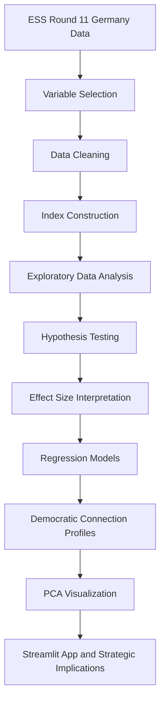

# What Builds Democratic Connection?

A data-driven analysis of democratic satisfaction, party trust, political efficacy, social trust and political participation in Germany using European Social Survey Round 11 data.

---

## 1. Project Overview

This project investigates what builds or weakens democratic connection in Germany.

The core assumption is that democratic disconnection is not one single problem. It can appear in different forms:

- low satisfaction with democracy
- low trust in political parties and politicians
- low perceived political efficacy
- low social trust
- subjective economic strain
- political disengagement or non-voting

The project therefore asks:

> What factors are associated with democratic satisfaction, party trust and political participation in Germany?

The goal is not only to describe political attitudes, but to identify meaningful trust gaps and translate them into evidence-informed strategic implications for democratic actors, political communication, civic engagement and public institutions.

---

## 2. Project Context

Public debates about democratic crisis often focus on election results, polarization or support for anti-democratic actors.

This project takes a broader analytical perspective.

Instead of asking only whether people vote or where they place themselves politically, it asks whether people feel politically heard, socially connected and institutionally represented.

The guiding idea is:

> Different democratic trust problems require different democratic responses.

This means that non-voters, disappointed voters and democratically connected citizens should not be treated as one homogeneous group.

---

## 3. Data Source

The project uses the official European Social Survey Round 11 integrated dataset, filtered for Germany.

- Source: European Social Survey Round 11
- Main country subset: Germany
- Full ESS11 integrated dataset: 50,116 respondents
- Germany subset: 2,420 respondents
- Extended clean analysis dataset: approximately 2,004 respondents
- Regression dataset: 2,064 respondents
- Raw data format: SPSS `.sav`
- Main tools: Python, pandas, scipy, statsmodels, scikit-learn, matplotlib, Plotly and Streamlit

Raw ESS data is not included in this repository. It can be downloaded from the official ESS Data Portal:

https://www.europeansocialsurvey.org/data/

---

## 4. Main Research Question

The main research question is:

> Which factors are associated with democratic satisfaction, trust in political parties and democratic participation in Germany?

The project focuses on five analytical dimensions:

1. political participation
2. political efficacy
3. social trust
4. subjective economic security
5. political orientation

---

## 5. Key Variables

### 5.1 Main outcome variables

The main outcome variables represent different dimensions of democratic trust and democratic satisfaction.

| Concept | ESS variable | Description |
|---|---|---|
| Democratic satisfaction | `stfdem` | Satisfaction with the way democracy works |
| Trust in parliament | `trstprl` | Trust in country's parliament |
| Trust in politicians | `trstplt` | Trust in politicians |
| Trust in political parties | `trstprt` | Trust in political parties |

### 5.2 Main explanatory variables

The explanatory variables represent possible factors associated with democratic connection.

| Concept | Variable / index | Description |
|---|---|---|
| Political efficacy | `political_efficacy_index` | Average of selected variables measuring perceived say, influence and ability to participate |
| Social trust | `social_trust_index` | Average of trust, fairness and helpfulness items |
| Economic security | `hincfel` | Subjective feeling about household income |
| Political orientation | `lrscale` | Left-right self-placement from 0 to 10 |
| Voting behavior | `vote_clean`, `vote_binary` | Voted or did not vote in the last national election |
| Controls | `agea`, `gndr`, `eduyrs` | Age, gender and years of education |

---

## 6. Analytical Pipeline

The project follows a structured analytical pipeline:



The logic is:

1. select relevant ESS variables
2. clean and document the Germany subset
3. construct political efficacy and social trust indices
4. explore descriptive trust patterns
5. test predefined trust gap hypotheses
6. estimate effect sizes
7. run regression models
8. create exploratory Democratic Connection Profiles
9. visualize profile structure with PCA
10. translate findings into strategic implications

---

## 7. Hypotheses

The project tests five main hypotheses.

### H1: Participation Gap

Respondents who voted in the last national election show higher democratic satisfaction and institutional trust than respondents who did not vote.

### H2: Political Efficacy Gap

Respondents with higher perceived political efficacy show higher democratic satisfaction and higher trust in parliament, politicians and political parties.

### H3: Social Trust Gap

Respondents with higher social trust show higher democratic satisfaction and higher institutional trust.

### H4: Economic Security Gap

Respondents who feel economically secure show higher democratic satisfaction and institutional trust than respondents who feel economically strained.

### H5: Political Orientation Pattern

Democratic satisfaction and institutional trust differ across left, center and right self-placement groups.

This hypothesis is interpreted carefully. Political orientation is treated as an analytical variable, not as a normative judgement.

---

## 8. Methods

### 8.1 Descriptive Analysis

The project first explores:

- sample size
- missing values
- variable distributions
- institutional trust rankings
- group means across voting behavior, political efficacy, social trust, income feeling and political orientation

### 8.2 Index Construction

Two main indices are constructed.

#### Political Efficacy Index

The political efficacy index combines variables measuring whether respondents feel that:

- the political system allows people to have a say
- the political system allows people to influence politics
- they are confident in their own ability to participate
- they are able to take an active role in a political group

Higher values indicate higher perceived political efficacy.

#### Social Trust Index

The social trust index combines variables measuring whether respondents think that:

- most people can be trusted
- most people try to be fair
- most people are helpful

Higher values indicate higher social trust.

### 8.3 Group Comparison Tests

The project uses:

- Welch’s t-test for two-group comparisons
- Cohen’s d for two-group effect sizes
- Kruskal-Wallis tests for comparisons with more than two groups
- epsilon-squared for approximate non-parametric effect sizes

The tests are used to assess whether observed trust gaps are statistically meaningful and practically relevant.

### 8.4 Regression Models

Two OLS regression models are estimated:

1. outcome: satisfaction with democracy
2. outcome: trust in political parties

Predictors include:

- political efficacy
- social trust
- income feeling
- left-right placement
- education
- age
- gender
- voting behavior

Robust HC3 standard errors are used.

The models are interpreted as associational models, not causal models.

### 8.5 Regression Diagnostics

Regression diagnostics include:

- Variance Inflation Factor checks for multicollinearity
- residual diagnostics
- observed-versus-predicted plots
- model fit comparison

The diagnostics are used to assess whether the regression models are sufficiently robust for cautious interpretation.

### 8.6 Clustering

K-Means clustering is used to identify exploratory Democratic Connection Profiles.

The clustering variables are:

- democratic satisfaction
- party trust
- political efficacy
- social trust
- income feeling
- left-right placement
- voting participation

The final solution uses three clusters because this solution is strategically interpretable and separates different forms of democratic connection and disconnection.

The clusters are interpreted as exploratory segmentation patterns, not as fixed social groups.

### 8.7 PCA Visualization

Principal Component Analysis is used to visualize the multidimensional profile structure.

PCA is not used to prove the clusters. It is used as a visual aid to show how respondents and profiles are positioned in a reduced two- or three-dimensional space.

---

## 9. Key Findings

### 9.1 Institutional Trust Pattern

Trust in political parties and politicians is lower than trust in other institutions such as the police or the legal system.

This supports the project’s focus on party trust and democratic connection.

### 9.2 Participation Gap

Voters show higher democratic satisfaction and institutional trust than non-voters.

The differences are statistically meaningful and show medium-sized effects.

The strongest difference appears for trust in parliament.

### 9.3 Political Efficacy Gap

Political efficacy is one of the strongest signals in the analysis.

Respondents with higher political efficacy show substantially higher democratic satisfaction and higher trust in parliament, politicians and political parties.

The strongest effect appears for trust in parliament.

### 9.4 Social Trust Gap

Respondents with higher social trust also show higher democratic satisfaction and institutional trust.

The effects are consistently meaningful and support the idea that democratic trust is connected not only to institutions, but also to broader social confidence.

### 9.5 Economic Security Gap

Respondents who feel economically secure show higher democratic satisfaction and institutional trust than respondents who feel economically strained.

However, the effect sizes are smaller than for political efficacy, social trust and voting participation.

### 9.6 Political Orientation Pattern

Democratic satisfaction and institutional trust differ across left-right self-placement groups.

However, effect sizes are comparatively small. Political orientation matters, but it is not the strongest explanatory dimension in this analysis.

### 9.7 Correlation Analysis

The correlation analysis confirms that political efficacy and social trust have the strongest associations with the main democratic trust outcomes.

Political efficacy has the strongest correlation with trust in parliament, trust in politicians, trust in political parties and democratic satisfaction.

Social trust is the second strongest explanatory dimension across most outcomes.

Subjective income feeling, left-right placement, education and age are also associated with democratic trust, but the correlations are weaker.

### 9.8 Regression Results

Regression models confirm the central analytical direction.

Political efficacy and social trust remain the strongest predictors of both democratic satisfaction and trust in political parties, even when controlling for income feeling, left-right placement, education, age, gender and voting behavior.

The models explain around one quarter of the variation in the outcomes, which is meaningful for cross-sectional survey data.

### 9.9 Democratic Connection Profiles

The cluster analysis identifies three exploratory Democratic Connection Profiles.

| Profile | Share | Main pattern |
|---|---:|---|
| Connected Democratic Core | ~50% | Higher democratic satisfaction, higher party trust, higher political efficacy, higher social trust and voting participation |
| Disappointed Democratic Participants | ~39% | Still voting, but low democratic satisfaction, low party trust, lower political efficacy and lower social trust |
| Disengaged Non-voters | ~11% | No reported voting participation, low political efficacy and low party trust |

The most important insight is:

> Democratic disconnection is not only about non-voters. A large group still participates electorally while already showing low democratic satisfaction, low party trust and lower political efficacy.

### 9.10 PCA Results

PCA helps visualize the multidimensional profile structure.

The first principal component captures a broad democratic connection dimension. Higher values are associated with higher democratic satisfaction, party trust, political efficacy, social trust and voting participation.

The PCA map supports the profile logic visually, but the profiles overlap. This is expected in social survey data and confirms that the profiles should be interpreted as exploratory segmentation patterns, not sharply separated social groups.

---

## 10. Strategic Interpretation

The findings suggest that democratic actors should not rely on one generic trust-building strategy.

Different profiles imply different strategic priorities.

### 10.1 Connected Democratic Core

Strategic challenge:

- maintain trust
- avoid taking democratic support for granted

Possible response:

- credible delivery
- transparent communication
- meaningful participation opportunities

### 10.2 Disappointed Democratic Participants

Strategic challenge:

- rebuild trust before disappointment turns into deeper disengagement

Possible response:

- visible problem-solving
- local listening formats
- credible explanations of political constraints and progress
- stronger responsiveness and participation channels

### 10.3 Disengaged Non-voters

Strategic challenge:

- lower barriers to re-engagement
- rebuild basic political efficacy

Possible response:

- outreach beyond traditional party channels
- low-threshold civic engagement
- community-based trust-building
- practical participation formats

---

## 11. Repository Structure

```text
.
├── app/
│   └── app.py
├── data/
│   ├── raw/
│   │   └── ESS11e04_1.sav
│   ├── clean/
│   │   ├── ess11_germany_core_clean.csv
│   │   ├── ess11_germany_extended_clean.csv
│   │   ├── ess11_germany_regression_dataset.csv
│   │   └── ess11_germany_democratic_connection_profiles.csv
│   └── processed/
│       ├── participation_gap_validation.csv
│       ├── political_efficacy_gap_validation.csv
│       ├── social_trust_gap_validation.csv
│       ├── economic_security_gap_binary_validation.csv
│       ├── economic_security_gap_original_groups_validation.csv
│       ├── political_orientation_pattern_validation.csv
│       ├── trust_gap_strength_ranking.csv
│       ├── analytical_priority_table.csv
│       ├── final_variable_correlation_matrix.csv
│       ├── outcome_correlation_summary.csv
│       ├── party_trust_correlation_ranking.csv
│       ├── democracy_satisfaction_correlation_ranking.csv
│       ├── regression_results_democracy_satisfaction_party_trust.csv
│       ├── regression_model_comparison.csv
│       ├── regression_diagnostic_summary.csv
│       ├── regression_vif_results.csv
│       ├── democratic_connection_profile_summary.csv
│       ├── democratic_connection_profile_summary_final.csv
│       ├── democratic_connection_profile_z_summary.csv
│       ├── democratic_connection_profile_strategy_table.csv
│       ├── pca_democratic_connection_profiles.csv
│       ├── pca_explained_variance.csv
│       └── pca_component_loadings.csv
├── notebooks/
│   └── ESS11_Data_Snapshot_Germany.ipynb
├── visualizations/
│   └── exported charts and figures
├── README.md
└── requirements.txt
```

Note: The raw ESS `.sav` file is not included in this repository and needs to be downloaded separately from the ESS Data Portal.

---

## 12. Main Outputs

The project currently produces:

- cleaned Germany analysis datasets
- statistical validation tables
- effect size summaries
- correlation outputs
- regression results
- regression diagnostics
- Democratic Connection Profile tables
- PCA outputs
- static visualizations
- interactive Streamlit app prototype

---

## 13. How to Run the Project

### 13.1 Install Dependencies

```bash
pip install pandas numpy scipy statsmodels scikit-learn matplotlib plotly streamlit pyreadstat openpyxl
```

### 13.2 Run the Notebook

Open the notebook in Jupyter or VS Code and run the cells from top to bottom.

The notebook creates cleaned datasets and processed output tables.

### 13.3 Run the Streamlit App

From the project root folder, run:

```bash
streamlit run app/app.py
```

The project root folder is the folder that contains the `app`, `data`, `notebooks` and `visualizations` directories.

---

## 14. Limitations

This project has several important limitations.

First, the analysis is based on cross-sectional survey data. Therefore, results show associations, not causal effects.

Second, the cluster analysis is exploratory. The Democratic Connection Profiles should be interpreted as analytical segmentation patterns, not as fixed population types.

Third, PCA is used as a visualization aid. It helps communicate multidimensional patterns but does not prove cluster validity.

Fourth, the analysis focuses on selected ESS variables. Other factors such as media use, regional context, migration attitudes, party preference or longitudinal changes may further improve the analysis.

Fifth, the analysis currently focuses on Germany. Cross-country comparison may be added later as an extension.

Sixth, ESS survey data is based on self-reported attitudes and behavior. This can introduce measurement limitations, recall bias or social desirability bias.

---

## 15. Ethical and Interpretative Note

The project does not classify individuals as democrats or anti-democrats.

The Democratic Connection Profiles are exploratory analytical profiles based on selected survey indicators. They are used to understand patterns of democratic satisfaction, trust, efficacy and participation.

Political orientation is treated carefully and descriptively. The project does not make stigmatizing claims about political groups.

All results are interpreted as evidence-informed associations, not as deterministic or causal conclusions.

---

## 16. Next Steps

Potential next steps are:

- improve the Streamlit app layout and interactivity
- integrate interactive PCA visualizations
- refine final presentation storytelling
- improve visual design and methodological notes in charts
- add optional cross-country comparison
- test additional variables such as media use or political interest
- prepare final recommendations for democratic engagement strategy

---

## 17. Core Conclusion

The project shows that democratic disconnection in Germany is not one single problem.

The strongest analytical signals are political efficacy and social trust.

Non-voting matters, but the more strategically important finding is that a large group still votes while already showing low democratic satisfaction, low party trust and lower perceived political efficacy.

This supports the main project argument:

> To strengthen democracy, democratic actors should not only communicate better. They need to rebuild political efficacy, social confidence and credible democratic responsiveness.